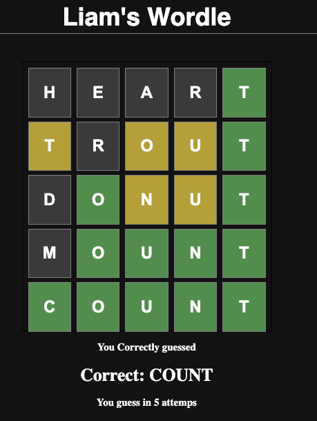

# My Wordle Clone

I followed the Youtube tutorial found [here](https://youtu.be/WDTNwmXUz2c) made by @PedroTech.

This project was bootstrapped with [Create React App](https://github.com/facebook/create-react-app).

## Future things I want to do

- [ ] Fix the logic so that it recognises _how many_ letters are present. At the moment, if the correct word was "ABCDE" and you guessed "EEEEA", it would highlight all the Es as yellow, when in fact only one of them should technically be yellow.
- [ ] Try out doing some animation of the letters when you submit a new guess (e.g. rotating the keys/tiles)
- [ ] Figure out how to hook up a backend to store user stats (e.g. number games played, average # guesses til correct etc. )
